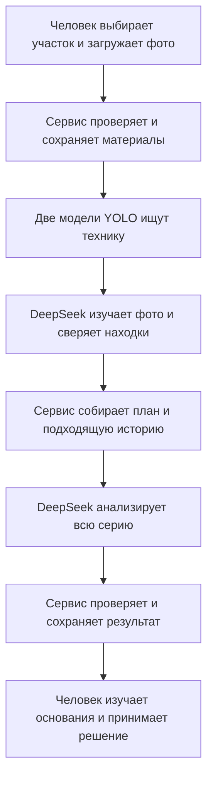
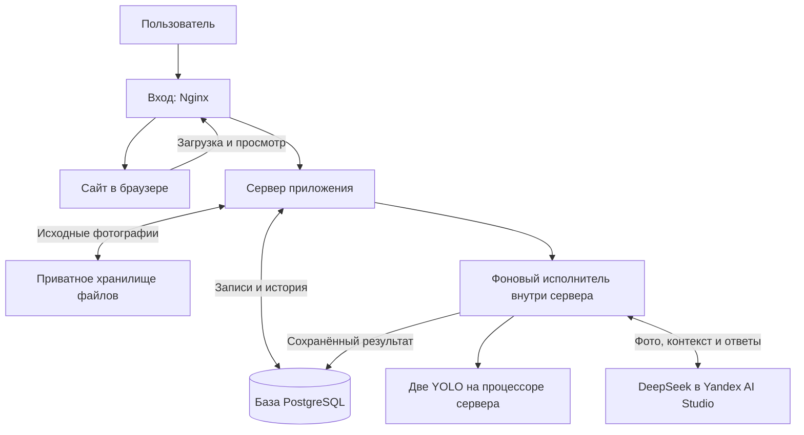
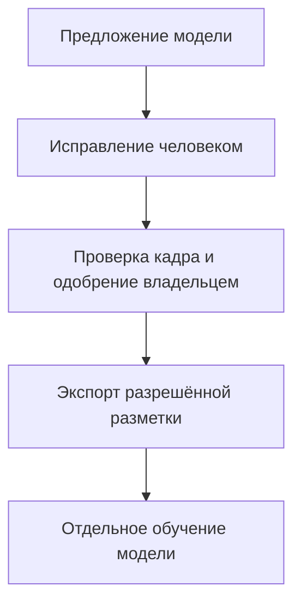

# Как работает «Контроль строительства»

Приложение помогает человеку разбирать фотографии стройки. Оно ищет технику и видимые признаки работ, предлагает возможный этап строительства и отмечает ситуации, которые стоит проверить. Если для участка задан план, приложение сопоставляет наблюдения с работами, запланированными на время съёмки.

Результат анализа — **предположения с основаниями**, а не акт о нарушении и не окончательная оценка стройки. Человек смотрит исходные фотографии, проверяет выводы и отдельно подтверждает этап или исправляет разметку.

Документ описывает реализацию в коде на 27 сентября 2026 года. Он не подтверждает, что именно эта версия сейчас работает на удалённом сервере, и не оценивает точность моделей.

## 1. Пример: от фотографий до решения

Представим, что на участке должны идти земляные работы. Пользователь выбирает участок, указывает время съёмки и загружает несколько фотографий. В план заранее внесены работа, её сроки и ожидаемая техника.

Приложение ищет на снимках экскаватор, самосвал и признаки земляных работ. Оно может предложить: «На участке, вероятно, идёт разработка грунта». Если ожидаемая техника не обнаружена на достаточном числе пригодных кадров, появляется повод проверить ситуацию. Это ещё не означает, что техника отсутствовала на всей площадке или что график сорван.

Это основной **гибридный** путь: в нём участвуют и модели поиска объектов YOLO, и облачная модель DeepSeek. Сохраняется также совместимый вариант анализа только через DeepSeek. Какой вариант исполняется, задаёт профиль — сохранённый набор настроек модели и правил обработки.

## 2. Из каких частей состоит приложение

Можно представить приложение как небольшую команду: окно приёма материалов, координатор, специалисты по фотографиям и архив.

| Часть | Что она делает | Название в коде |
| --- | --- | --- |
| Сайт | Позволяет выбрать проект и участок, загрузить фото, заполнить план и посмотреть результат | React, папка `web` |
| Сервер приложения | Проверяет запросы, управляет анализами, собирает контекст и выдаёт сохранённые результаты | Python и FastAPI, папка `backend` |
| Фоновый исполнитель | Берёт ожидающий анализ и проводит его через обработку | `ClaimLoop`, внутри серверного приложения |
| Две модели поиска техники | Предлагают, какие объекты видны и где они находятся | YOLO, файлы `apoce.pt` и `kaggle.pt` |
| Облачная модель | Изучает фотографии, сверяет предложения YOLO и формирует общий разбор | DeepSeek через Yandex AI Studio |
| База записей | Хранит проекты, планы, состояния анализов, ответы моделей и решения людей | PostgreSQL |
| Хранилище файлов | Хранит исходные фотографии и другие файловые материалы | Приватное S3-хранилище; в Compose используется MinIO |
| Входной веб-сервер | Отдаёт сайт и направляет его запросы серверу приложения | Nginx |

Фоновый исполнитель сейчас является частью сервера приложения. Очередь ожидающих анализов хранится в базе; отдельного сервиса очередей для этого пути нет.

«На процессоре сервера» означает, что YOLO работают там, где запущено серверное приложение. При размещении приложения в облаке это процессор облачного сервера, а не компьютер пользователя. Отдельная видеокарта для этого пути не используется.

## 3. Зачем нужны проект, участок и план

**Проект** объединяет строительный объект, его участки и анализы. **Участок** уточняет, к какой части стройки относятся фотографии. Это позволяет сопоставлять материалы одной зоны, не смешивая их с другой.

**Каталог работ** — справочник названий. Он сам не определяет, когда и где должны выполняться работы. **План участка** заполняется отдельно: в нём есть работы, сроки, этапы и ожидаемая, допустимая или исключённая техника.

Если анализ сравнивается с планом, он привязан к выбранной сохранённой версии этого плана. Если завтра человек изменит сроки, сегодняшний результат продолжит ссылаться на прежнюю версию. Поэтому можно восстановить, с чем именно приложение сравнивало фотографии.

Без плана приложение может описать видимую сцену и предложить проверки. Для вывода о несоответствии плану нужна применимая работа этого участка и её сроки.

## 4. Что происходит после нажатия «Запустить анализ»

### Подготовка и сохранение

Пользователь задаёт проект и участок, порядок фотографий, время съёмки и при необходимости выбирает сохранённую версию плана. Перед облачным анализом требуется явное согласие на передачу выбранных фотографий и контекста.

Сервер проверяет формат JPEG или PNG, возможность прочитать изображения, размеры запроса и допустимость выбранных данных. Оригиналы сохраняются без изменений. Для каждого файла вычисляется цифровой отпечаток — контрольная сумма, позволяющая обнаружить подмену или повреждение.

Создаётся запись анализа с выбранными настройками модели и контекстом. Тяжёлая обработка выполняется в фоне: сайт затем получает состояние и результат этого анализа. Потеря связи с сайтом сама по себе не означает, что работа на сервере остановилась.

### Поиск объектов на каждом кадре

В гибридном варианте каждую фотографию сначала изучают две YOLO. Они выдают предложения: класс техники, рамку вокруг объекта и числовую оценку уверенности. Модели могут ошибаться и расходиться во мнениях.

Затем DeepSeek получает саму фотографию и оба набора предложений. Модель должна сопоставить их с физическими объектами, объяснить расхождения и указать для каждой находки YOLO: принята она, отклонена или осталась неопределённой. Совпавшие предложения двух моделей не должны превращаться в две записи об одной машине.

Перед распознаванием учитывается поворот фотографии. Поэтому рамки привязаны к изображению в правильной ориентации, а оригинальный файл остаётся сохранённым.

### Сбор контекста и общий разбор

После разбора кадров сервер собирает наблюдения, порядок и время снимков, сведения об участке, выбранную версию плана и результаты правил сравнения с ним.

При надёжно заданных временах он может добавить **до трёх более ранних успешных анализов того же участка**. Вся их съёмка должна предшествовать самому раннему новому кадру. Чужие участки и более поздние наблюдения в такую историю не попадают. Без участка или надёжных времён история не используется.

В гибридном варианте DeepSeek получает этот контекст вместе с фотографиями серии для одного общего разбора. В варианте только через DeepSeek общий разбор использует сохранённые наблюдения и контекст без повторной передачи серии фотографий.

### Проверка и публикация результата

Сервер проверяет, что ответ завершён, соответствует ожидаемой структуре и правильно ссылается на кадры, объекты и работы плана. Некорректный или неопределённый ответ не становится успешным результатом.

После проверки итог для сайта и связанные сигналы сохраняются вместе. Сигнал — сохранённая ситуация для проверки с её основаниями. На странице результата можно изучить выводы, ограничения и фотографии, на которых они основаны; в гибридном анализе — также переключиться между согласованными рамками и исходными находками каждой YOLO.

Правильно оформленный ответ всё ещё может содержать ошибочное толкование фотографии. Проверка структуры не заменяет проверку человеком и измерение качества на независимых снимках.

## 5. Что означают выводы

Здесь важно различать три уровня:

| Уровень | Пример | Как его читать |
| --- | --- | --- |
| Наблюдение модели | «На кадре найден объект, похожий на экскаватор» | Это результат распознавания; его можно сверить с фото |
| Предположение | «Вероятно, идут земляные работы» | Модель связывает технику и признаки сцены; вывод требует проверки |
| Решение человека | «Этап подтверждён» | Это отдельная сохранённая запись человека |

Сервис использует восемь известных классов техники: экскаватор, самосвал, дорожный каток, кран на грузовом шасси, автобетоносмеситель, бульдозер, грузовик и мобильный кран. Он может сохранить объект со свободным названием или неопределённым типом. Это не добавляет новый класс в каталог автоматически. Широкое обозначение вроде «подъёмная техника» не превращается автоматически в конкретный тип крана.

В результатах предусмотрены четыре состояния оценки техники: техника обнаружена; не обнаружена на кадре; данных недостаточно; этот класс не анализировался. **«Не обнаружена» не означает «её точно нет на стройке».** Объект вне кадра, перекрытая машина и неподходящий ракурс ограничивают вывод.

Правило об ожидаемой, но не найденной технике требует как минимум трёх разных пригодных кадров, относящихся к срокам нужной работы и позволяющих оценить этот класс. Копии одного снимка не дают независимых подтверждений. Одновременные работы также учитываются: техника, разрешённая одной из них, не должна считаться лишней только из-за другой.

«Признаки работы» требуют видимого действия. «Возможный простой» требует сопоставимых разных кадров с временами, того же участка, обоснованного сопоставления одной машины и дополнительных видимых признаков неработающего состояния. Один снимок не доказывает движение, длительность простоя или нарушение норм безопасности.

## 6. Что хранится и почему история не переписывается

| Где | Что сохраняется | Для чего |
| --- | --- | --- |
| Хранилище файлов | Исходные фотографии и прежние файловые материалы | Вернуться к источнику и проверить его целостность |
| База записей | Проекты, участки, версии планов, настройки и состояние анализа | Восстановить условия запуска |
| База записей | Ответы моделей, обработанные наблюдения, находки YOLO, контекст и сведения об использовании облачной модели | Понять происхождение результата |
| База записей | Сигналы, подтверждения этапа, версии исправлений, обратная связь | Сохранить последующую работу человека |

Исходные ответы и зафиксированный контекст сохраняются как неизменяемые записи. Исправление рамки или класса создаёт новую версию отдельно от ответа модели; подтверждение этапа тоже хранится отдельно.

Повторное наблюдение той же ситуации не должно создавать лишние дубликаты, открывать сигнал, уже закрытый человеком, или автоматически закрывать предыдущие сигналы.

Старые анализы и отчёты сохраняются для чтения, даже если в них нет сегодняшнего общего разбора. Прежние DINO/Qwen-профили выведены из исполнения. Исторические сравнения моделей не выбирают автоматически модель для нового анализа.

## 7. Что происходит при ошибках

Приложение отдельно защищает повтор загрузки и выполнение облачного запроса. Это разные операции.

Если ответ о загрузке потерялся, повтор с тем же идентификатором запроса и теми же данными возвращает тот же анализ. Другие данные с тем же идентификатором отклоняются. Такая защита не запускает модель второй раз.

Перед каждым обращением к DeepSeek сервер сохраняет запись о запланированном вызове. Если связь оборвалась и неизвестно, успела ли облачная модель его обработать, приложение **не отправляет этот вызов автоматически ещё раз**. Иначе можно повторно расходовать квоту и получить два разных ответа.

Фоновый исполнитель получает временное право обрабатывать анализ и регулярно продлевает его. Если право истекло, он больше не может опубликовать успешный итог. Восстановление после сбоя помечает прерванный анализ как неуспешный, сохраняя уже записанные основания.

Повторить неуспешный анализ можно, только если сбой произошёл до того, как сервер записал первое запланированное обращение к DeepSeek. В остальных случаях новый анализ — отдельное осознанное действие. Уже сохранённые результаты остаются доступны в истории.

## 8. Где работает сервис и кто имеет доступ

В описанном в репозитории запуске через Docker Compose вместе работают сайт с Nginx, сервер приложения, PostgreSQL и MinIO. Перед стартом отдельный шаг обновляет структуру базы и импортирует каталог работ. Данные базы и файлового хранилища сохраняются в отдельных томах — постоянных хранилищах контейнеров.

YOLO используют процессор сервера; DeepSeek вызывается во внешнем облаке Yandex AI Studio. Обучение моделей на Windows с видеокартой — отдельный процесс, который не выполняется при пользовательском анализе.

Файловое хранилище закрыто от прямого анонимного чтения. Фотографии выдаются через приложение в связи с конкретным анализом. При этом **к пользовательским функциям сервера — работе с проектами, изображениями и анализами — сейчас можно обращаться без входа в аккаунт**. Приватное хранилище само по себе не делает приложение закрытым для посторонних; для ограниченного размещения требуется внешний контроль доступа.

Кабинет владельца защищён паролем и временной сессией. Для удалённого административного входа требуется HTTPS — шифрованное соединение. Административные изменения дополнительно защищены от запросов, подставленных сторонним сайтом. Подробности настройки находятся в [инструкции развёртывания](infra/deploy/README.md).

Проверка готовности сервиса проверяет базу, структуру данных, файловое хранилище, восстановление после сбоев и, при заданном профиле, настройки исполнителя. Она не делает платный запрос модели и не доказывает качество распознавания. Без настроенного профиля можно читать данные, но запускать анализ нельзя.

## 9. Как исправления могут помочь улучшить модели

Пользователь может предложить исправление разметки фотографии. Для экспорта в обучающий набор нужны проверка всего кадра, явное сопоставление объектов с классами каталога и одобрение владельца. Фотографии, отложенные для независимой проверки качества модели и других контрольных проверок, исключаются из экспорта в обучающий набор.

Сам факт исправления не переобучает модель и не меняет уже выполненные анализы. Машинная разметка не считается проверенным эталоном. Для оценки качества нужны независимые данные; успешный технический запуск подтверждает только возможность исполнения.

## 10. Где посмотреть подробности

Это объяснение устройства приложения. Точные настройки, команды и правила реализации находятся в следующих документах и модулях:

| Что нужно узнать | Где искать |
| --- | --- |
| Как запустить сервис и настроить окружение | [README](README.md) |
| Какие модули отвечают за функции | [Путеводитель по коду](docs/CODE_GUIDE.md) |
| Как загружаются и сохраняются материалы | [Загрузка](backend/app/application/submission.py) |
| Как исполнитель получает работу и обращается к модели | [Исполнитель](backend/app/application/executor.py), [анализ DeepSeek](backend/app/application/deepseek_runtime.py) |
| Как сверяются предложения моделей и проверяется общий разбор | [Гибридный профиль](backend/app/profiles/hybrid.py), [YOLO](backend/app/profiles/yolo.py) |
| Как фото сопоставляются с планом | [Правила сравнения](backend/app/domain/site_analysis.py) |
| Как воспроизвести гибридный путь и проверить ограничения | [Инструкция гибридного анализа](docs/HYBRID_PHOTO_SIGNALS.md) |
| Как готовятся данные и обучение на Windows | [Обучение моделей](training/windows/README.md) |
| Какие проверки ранее выполнялись | [Отчёт проверок DeepSeek](docs/DEEPSEEK_VERIFICATION.md) |

## Технические подробности для разработчиков

### Связь с прежними архитектурными решениями

Для разработчиков сохранён [исторический набор решений](_bmad-output/planning-artifacts/architecture/architecture-lzt-detecing-violations-system-2026-09-21/ARCHITECTURE-SPINE.md). Его идентификаторы остаются ссылками на историю, а активный путь DINO/Qwen заменён описанным выше DeepSeek и гибридным анализом.

| Исторические решения | Что сохраняется в текущей реализации |
| --- | --- |
| AD-5 | Явный пользовательский контекст и зафиксированная версия плана; каталог не создаёт расписание |
| AD-7 | Прежние сравнения доступны для чтения; выведенные профили нельзя запускать |
| AD-10, AD-28 | Оригиналы в приватном S3; новые ответы и контекст — в неизменяемых записях PostgreSQL |
| AD-17 | Запись вызова до отправки, временное право исполнителя и запрет повтора неопределённого вызова |
| AD-20 | Четыре состояния классов; неизвестные объекты и объекты без рамки сохраняются без выдуманных значений |
| AD-30, AD-37, AD-38 | Анализ фиксирует настройки и согласие; создание профиля проверяет конфигурацию без платного пробного вызова и без утверждения о точности |

Настройки профиля фиксируют модель, режим, инструкцию, формат ответа и их контрольные суммы. Для гибридного профиля фиксируются также файлы YOLO, их классы и правила сопоставления. Файлы моделей проверяются перед исполнением, загружаются один раз и используют общий запрет одновременного обращения. При этом облачное имя модели с `latest` не гарантирует неизменность её весов у провайдера; фактический идентификатор модели и ответ сохраняются для аудита.
