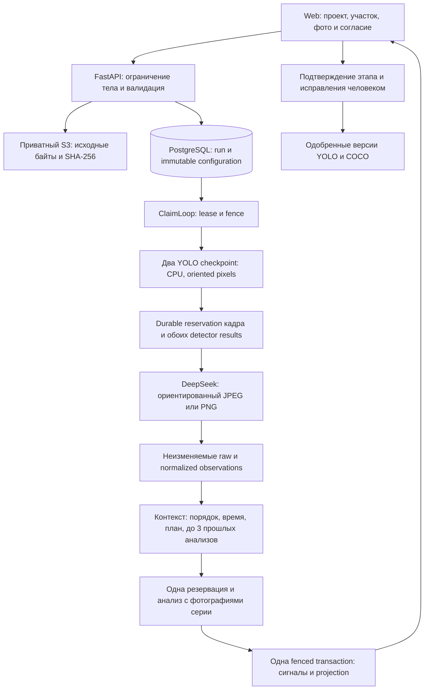

# Архитектура сервиса

Этот документ описывает текущую архитектуру DeepSeek и заменяет активный путь DINO/Qwen из [исторического architecture spine](_bmad-output/planning-artifacts/architecture/architecture-lzt-detecing-violations-system-2026-09-21/ARCHITECTURE-SPINE.md). Идентификаторы старых решений и сохранённые доказательства остаются действительными как история.

| Историческое решение | Применение в текущей ревизии |
| --- | --- |
| AD-5 | Пользовательский контекст остаётся явным; вручную выбранная неизменяемая версия плана дополняет его. Каталог не создаёт календарный план. |
| AD-7 | Старые сравнения и отчёты доступны для чтения; запуск выведенных профилей запрещён. Они не выбирают текущую модель. |
| AD-10, AD-28 | Исходные фото и прежние артефакты остаются в приватном S3. Новые JSON-ответы и контекст хранятся в добавочных неизменяемых таблицах PostgreSQL. |
| AD-17 | Резервация сохраняется до запроса, истёкшая lease запрещает успешную публикацию, неопределённый вызов не повторяется. |
| AD-20 | Четыре состояния известных классов сохранены; дополнительно хранятся свободные объекты с неизвестным типом и без рамки. |
| AD-30, AD-37, AD-38 | Новый профиль фиксирует модель, схему, инструкцию и режим; каждый пользовательский запуск фиксирует согласие. Создание профиля проверяет конфигурацию, без платного admission/probe и без утверждения о точности модели. |

Run привязан к профилю и ревизии авторизации. Повтор idempotent HTTP-загрузки возвращает тот же run. Отдельные уникальные резервации `deepseek_calls(run_id,call_key)` создаются до отправки. Отсутствие строки результата после резервации означает неопределённый исход, а не разрешение на повтор. Истечение lease запрещает публикацию успешного результата; recovery переводит прерванный run в failed. Резервации, контекст и raw response защищены от UPDATE/DELETE триггерами.

Нормализация проверяет модель, завершённость, reasoning, usage, строгий JSON, восемь известных классов плюс свободные имена, координаты и ссылки рисков. Объекты без рамки и без confidence сохраняются без искусственных значений. Снимок включает версии и хеши инструкции/схемы. Старый результат без аналитики остаётся читаемым. Исправления и решения человека версионируются отдельно.

История анализа ограничена тем же `zone_id`, успешными run и временем съёмки строго раньше самого раннего нового кадра. Ненадёжные или неупорядоченные времена исключают history. План читается по immutable `run_plan_bindings.revision_id`, а не по текущему плану участка.

Гибридный профиль `hybrid-photo-signals-v1` совместим с `kind=deepseek`, но имеет отдельные хеши схемы, инструкции и manifest. Старый `deepseek-service-v1` остаётся валидным для истории и исполнения. При запуске hybrid-профиля оба checkpoint из `artifacts/Models` проверяются по SHA-256 и исходным классам, загружаются один раз и исполняются на CPU под общим lock. Manifest `backend/app/data/yolo-manifest.json` фиксирует зависимости, настройки, классы и nullable mapping. APOCE `lifting-equipment` не считается автоматически `mobile_crane`.

Контекст каждого frame-call сохраняет оба набора сырых детекций с нормализованными рамками и confidence; ответ DeepSeek объединяет физические объекты и обязан объяснить судьбу каждой детекции. Assessment получает сами фотографии, timestamps, неизменяемую ревизию, до трёх предыдущих результатов и вычисленные правила. Неоцениваемые классы и повторяющиеся хеши не дают доказательство отсутствия. Сопоставление выполняется отдельно для каждого кадра и каждой применимой работы, включая одновременные операции и границы интервалов.

`working_signs` требует видимого действия. `possible_idle` требует сопоставимой независимой серии, времён, одного участка, явного соответствия физического объекта и дополнительных видимых признаков неработающего состояния. Это гипотеза, требующая проверки; движение и длительность не выводятся из одного снимка. Правильная структура ответа не доказывает семантическую точность.

Процессные сигналы допускаются без плана, но с участком. Плановые риски требуют применимой работы. Основание сохраняет frozen frames/наблюдения/детекции и точный план; fingerprint использует участок, ревизию, причину, работу, исходные хеши, класс и исходные идентификаторы детекций цитированных наблюдений, без текста и run ID. Сигналы и projection публикуются одной lease-fenced transaction. Повторное наблюдение не открывает закрытый человеком сигнал и не закрывает прежние сигналы автоматически.

Качество обоих YOLO checkpoint и гибридных выводов требует независимого контрольного набора. Машинные предложения разметки не являются ground truth. Реальный технический CPU/cloud smoke не означает готовность продукта. Обучение на Windows/RTX остаётся отдельным процессом; описание — [training/windows/README.md](training/windows/README.md).

Граница доступа: публичные API проекта и анализа, закрытые административные API с HTTPS/cookie/Origin/CSRF; S3 всегда приватный. Nginx снимает `/api/` и передаёт фиксированный root prefix; документация использует относительный OpenAPI URL и работает также прямо на backend. Никаких runtime-файлов из `/private/tmp` не требуется.
