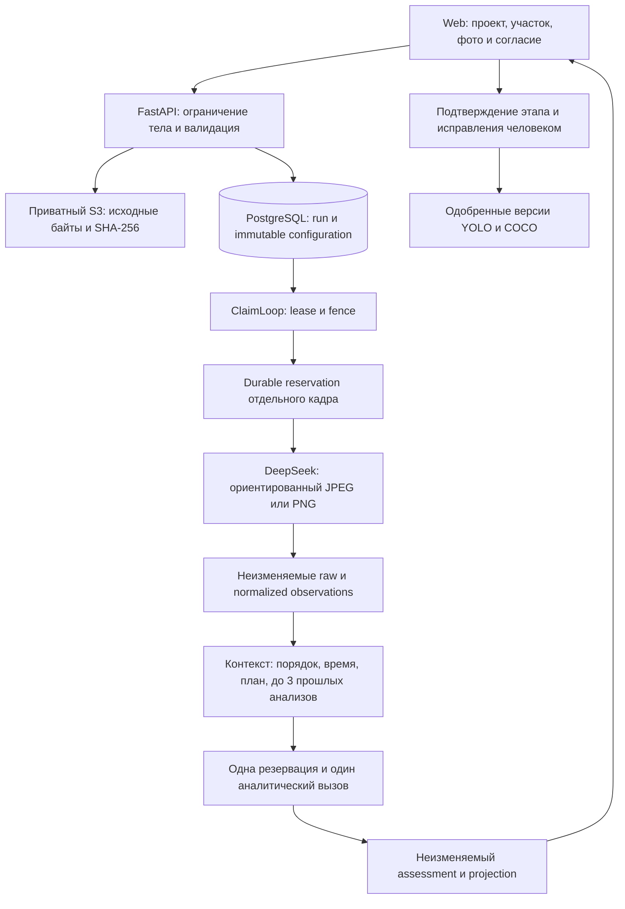
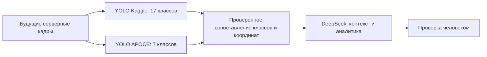

# Архитектура сервиса

Этот документ описывает текущую архитектуру DeepSeek и заменяет активный путь DINO/Qwen из [исторического architecture spine](_bmad-output/planning-artifacts/architecture/architecture-lzt-detecing-violations-system-2026-09-21/ARCHITECTURE-SPINE.md). Идентификаторы старых решений и сохранённые доказательства остаются действительными как история.

| Историческое решение | Применение в текущей ревизии |
| --- | --- |
| AD-5 | Пользовательский контекст остаётся явным; вручную выбранная неизменяемая версия плана дополняет его. Каталог не создаёт календарный план. |
| AD-7 | Старые сравнения и отчёты доступны для чтения; запуск выведенных профилей запрещён. Они не выбирают текущую модель. |
| AD-10, AD-28 | Исходные фото и прежние артефакты остаются в приватном S3. Новые JSON-ответы и контекст хранятся в добавочных неизменяемых таблицах PostgreSQL. |
| AD-17 | Резервация сохраняется до запроса, истёкшая lease запрещает успешную публикацию, неопределённый вызов не повторяется. |
| AD-20 | Четыре состояния известных классов сохранены; дополнительно хранятся свободные объекты с неизвестным типом и без рамки. |
| AD-30, AD-37, AD-38 | Новый профиль фиксирует модель, схему, инструкцию и режим; каждый пользовательский запуск фиксирует согласие. Создание профиля проверяет конфигурацию, без платного admission/probe и без утверждения о точности модели. |

Run привязан к профилю и ревизии авторизации. Повтор idempotent HTTP-загрузки возвращает тот же run. Отдельные уникальные резервации `deepseek_calls(run_id,call_key)` создаются до отправки. Отсутствие строки результата после резервации означает неопределённый исход, а не разрешение на повтор. Истечение lease запрещает публикацию успешного результата; recovery переводит прерванный run в failed. Резервации, контекст и raw response защищены от UPDATE/DELETE триггерами.

Нормализация проверяет модель, завершённость, reasoning, usage, строгий JSON, восемь известных классов плюс свободные имена, координаты и ссылки рисков. Объекты без рамки и без confidence сохраняются без искусственных значений. Снимок включает версии и хеши инструкции/схемы. Старый результат без аналитики остаётся читаемым. Исправления и решения человека версионируются отдельно.

История анализа ограничена тем же `zone_id`, успешными run и временем съёмки строго раньше самого раннего нового кадра. Ненадёжные или неупорядоченные времена исключают history. План читается по immutable `run_plan_bindings.revision_id`, а не по текущему плану участка.

Будущий путь пока не реализован: веса не загружаются в runtime. Два независимых учебных набора Kaggle/APOCE — оба про технику, готового scene detector в наборе нет. Их не следует автоматически смешивать или считать готовыми серверными контрактами. Их классы требуют отдельной проверки семантики и явного отображения. Текущий eight-class training export остаётся совместимым и не включает свободные гипотезы без ручного решения.

Оба YOLO-профиля будут исполняться на сервере приложения, передавая DeepSeek результаты с идентичностью кадра и нормализованными координатами. Обучение на отдельной Windows-машине с RTX 3060 не входит в серверный runtime. [Таблица сопоставления классов и перенос результатов](training/windows/README.md) задают границу этой будущей интеграции; подключение весов и проверка качества ещё не выполнены.

Граница доступа: публичные API проекта и анализа, закрытые административные API с HTTPS/cookie/Origin/CSRF; S3 всегда приватный. Nginx снимает `/api/` и передаёт фиксированный root prefix; документация использует относительный OpenAPI URL и работает также прямо на backend. Никаких runtime-файлов из `/private/tmp` не требуется.
