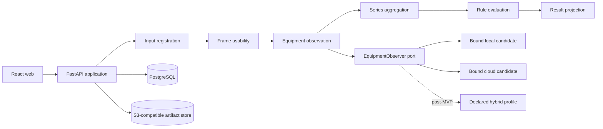

# Architecture Spine — Construction Monitoring Rapid MVP

## Design Paradigm

**Pipes and Filters with immutable evidence artifacts.** Domain filters exchange typed contracts and depend on ports, never on web, PostgreSQL, S3-compatible storage, or provider SDKs.



## Invariants & Rules

### AD-1 — Ordered evidence pipeline [ADOPTED]

- **Binds:** CAP-1 through CAP-6; all analysis filters.
- **Prevents:** A unit bypassing evidence stages or coupling a rule to a detector.
- **Rule:** Every run materializes fixed stage slots for input registration, frame usability, equipment observation, series aggregation, rule evaluation, and result projection in that order. A typed filter output is materialized only when its stage succeeds. Technical failure leaves downstream slots `skipped` and creates no `ResultProjection`. Observed facts, policy evaluation, and managerial check remain distinct typed artifacts.

### AD-2 — AnalysisRun is the reproducibility boundary [ADOPTED]

- **Binds:** CAP-1, CAP-2, CAP-4, CAP-5, CAP-6; run persistence.
- **Prevents:** Reprocessing from rewriting evidence or producing an untraceable result.
- **Rule:** An `AnalysisRun` binds intent, immutable input manifest, scenario/area/period, rule and policy snapshots, observer-profile revision, stage executions, invocation evidence, and final outcome. It is one candidate × fixture cell during comparison. Retry/reprocessing creates a linked successor.

### AD-5 — Analysis context is explicit, never schedule-derived [ADOPTED]

- **Binds:** CAP-1, CAP-2, CAP-4; submission and rules.
- **Prevents:** A filename, date, or overview silently selecting context.
- **Rule:** Every run receives excavation scenario, `ObservationArea`, period, and rule revision explicitly. The MVP owns no dated schedule, current-stage inference, or plan-health projection.

### AD-6 — Equipment observation is provider-independent [ADOPTED]

- **Binds:** CAP-1, CAP-2; adapters.
- **Prevents:** Provider SDK payloads leaking into aggregation, rules, API, or UI.
- **Rule:** `EquipmentObserver` emits AD-20's normalized contract and retains native response only as attributed evidence. Rule evaluation consumes neither native count, confidence, nor geometry.

### AD-7 — Provider comparison uses complete, distinct runs [ADOPTED]

- **Binds:** CAP-6; comparison batches.
- **Prevents:** Fusion, partial matrices, or readiness silently selecting a provider.
- **Rule:** A candidate enters comparison only after a locked real end-to-end fixture proves adapter → normalization → external artifact publication → PostgreSQL state → final projection. The required MVP comparison campaign begins with Grounding DINO Tiny CPU × an admitted Yandex AI Studio Qwen3.6 35B profile in the owner's account. RF-DETR remains draft and outside that required campaign until an independently approved rights-clear two-class corpus and group-disjoint split pass provenance, commercial-rights, sampled-label QA, and locked CPU smoke gates; public dataset format or licence labels alone never admit it. Kimi is a non-sensitive reserve canary, excluded from comparison until Russian signup, payment, commercial, and data-term gates are evidenced from the intended customer account. Campaign start atomically freezes the accepted Story 4.1 evaluation revision, policy, rule, taxonomy, preprocessing, candidate profiles, timeout, concurrency `1`, SDK retries `0`, and all planned cells before execution; the Qwen profile's authorized image hashes must include every campaign input. Earlier cloud pilot runs on another image set are historical development evidence, not campaign cells. A cell key and total order are `(campaign_id, repeat_ordinal, fixture_ordinal, candidate_ordinal)` using frozen ordinals; all three repeat matrices (`0..2`) materialize one `AnalysisRun` per candidate × `EvaluationFixtureRevision`, never per checksum. One cell executes at a time, and recovery selects the lowest non-terminal key. Every cell, including errors and timeouts, is terminal and retained; report denominators come from the immutable campaign manifest, not observed runs. Local, cloud, and hybrid remain undecided.

### AD-8 — Policy owns admission, sufficiency, and readiness [ADOPTED]

- **Binds:** CAP-2, CAP-3, CAP-6; admission and evaluation.
- **Prevents:** Threshold changes rewriting history or rules owning evidence quality.
- **Rule:** Immutable `PolicyProfile` alone owns input/frame admission, usability and series sufficiency/persistence, and prototype-readiness gates. Candidate/provider admission belongs to the observer-profile audit evidence governed by AD-30, AD-37, and AD-38. The initial policy revision accepts supported decodable images; unassessable accepted input is `insufficient_data`; a rule series needs at least three usable same-area images in explicit order. The 10–15-image evaluation requires positive, negative, insufficient-data, and out-of-scope fixtures plus zero false warnings. Misses, false detections, errors/timeouts, and repeated-run disagreements are reported separately; errors/timeouts are never excluded.

### AD-9 — Application-owned asynchronous execution [ADOPTED]

- **Binds:** API, executor, web polling.
- **Prevents:** HTTP lifetime owning inference or a broker becoming lifecycle authority.
- **Rule:** One single-host application instance owns the API and exactly one executor claim loop; horizontal replicas are post-MVP. Startup applies/checks migrations, completes PostgreSQL read/write smoke, completes the AD-28 isolated S3 health probe, runs fenced artifact reconciliation, then runs guarded run recovery before exposing readiness or enabling claims. Database lease expiry is authoritative: readiness waits until every prior `running` run either still has valid ownership or, after expiry, is terminalized with dependency skips in one fenced transaction. Submission atomically creates a `queued` run and stage rows; the executor claims PostgreSQL work and advances it asynchronously while the client polls persisted state. Liveness reports only process health; readiness stays false until every startup gate succeeds. No external message broker or adapter writes structured state.

### AD-10 — PostgreSQL state and external artifacts have separate ownership [ADOPTED]

- **Binds:** All persistence and evidence.
- **Prevents:** Blob storage in transactional rows or mutable files breaking reproducibility.
- **Rule:** PostgreSQL is the sole runtime database for domain revisions, run/stage lifecycle, observations, matrices, and artifact metadata/URI/size/checksum/lineage. A configured S3-compatible store owns image bytes, weights, rendered evidence, native responses, and reports. SQLite is prohibited for runtime, fallback, tests, or a second persistence implementation; `pgvector` is prohibited absent a versioned vector-search requirement.

### AD-11 — Pipeline progress is evidence-backed [ADOPTED]

- **Binds:** Pipeline UI and run details.
- **Prevents:** Simulated progress or merged retry evidence.
- **Rule:** Creation materializes fixed ordered stage rows. Each transition records timestamps, factual summary, artifact metadata, skip reason, or error code. UI renders only committed state by ordinal and never invents percentage.

### AD-12 — Rules own expectations, not evidence quality [ADOPTED]

- **Binds:** CAP-4, CAP-5; evaluation and explanation.
- **Prevents:** A rule becoming an opaque threshold or heuristic appearing normative.
- **Rule:** Immutable `RuleRevision` owns observable process, `continuous|periodic|not_informative` expectation, provenance, reason wording, and recommended human check. Unsupported/not-informative work maps to `not_analyzed`; heuristic and demonstration rules remain labeled.

### AD-13 — Summary-first, evidence-on-demand experience [ADOPTED]

- **Binds:** Submission, pipeline, result views.
- **Prevents:** Provider metadata obscuring the demonstrated decision path.
- **Rule:** Primary flow is context confirmation → submit → persisted pipeline → one backend outcome and any check. Details, policy, provenance, and native evidence are secondary views; UX wording/state derives from backend contracts.

### AD-14 — PostgreSQL-only transactional ownership [ADOPTED; changed from SQLite]

- **Binds:** PostgreSQL, SQLAlchemy, API, executor, recovery.
- **Prevents:** Divergent persistence implementations, lost claims, and transitions split from evidence references.
- **Rule:** SQLAlchemy uses PostgreSQL only with short transaction-scoped sessions. Startup rejects a non-PostgreSQL URL, requires migration head, and completes a PostgreSQL read/write smoke. Submission commits run, immutable manifest metadata, snapshots, and stages in one transaction. An immutable executor-policy snapshot fixes lease duration, renewal interval, and stale threshold; a worker renews only its own unexpired lease. The executor atomically claims a run/lease, performs inference outside a transaction, then commits each guarded stage/run transition and already-published artifact metadata together. Expected-prior state/revision and lease ownership fence every write.

### AD-17 — Restart recovery is explicit and evidence-preserving [ADOPTED]

- **Binds:** Executor lease, restart recovery, external calls.
- **Prevents:** An uncertain provider call being resumed, duplicated, or overwritten.
- **Rule:** Unclaimed queued runs remain eligible. Recovery uses the executor-policy stale threshold and a guarded lease-expiry transaction; database lease expiry is the sole recovery trigger. Owner/token mismatch blocks renewal and guarded writes but does not terminalize an unexpired run early. After expiry, recovery makes the run terminal `failed` with `executor_interrupted`; evidence remains visible and downstream stages are `dependency_failed`. Retry is a successor. The application-owned `ArtifactReconciler` runs at startup and by explicit operator command under one named PostgreSQL advisory lock. Each idempotent pass scans the AD-28 namespaces and intent states, records start/completion/error evidence, and must succeed before readiness and work claims. It may mark intent metadata `quarantined`, but never moves, deletes, replaces, or attaches bytes without a later explicit retention policy.

### AD-18 — One execution profile per run; no fallback [ADOPTED]

- **Binds:** CAP-1, CAP-2, CAP-6; adapters and retry.
- **Prevents:** Silent local/cloud/hybrid substitution inside one result.
- **Rule:** Immutable `ObserverExecutionProfileRevision` is bound before start. Timeout, malformed output, provider error, or missing artifact is terminal `failed`, not absence. Delivered-MVP execution accepts only non-hybrid admitted profiles; the profile contract may represent a future hybrid composition, but the executor rejects it until a same-evaluation comparison admits that composition in a later scope. A future hybrid fixes component order, routing predicate, permitted calls, terminal/failure mapping, aggregation, and all boundaries before start; it never routes on a component failure or observed class state. Another profile is allowed only in a new linked run. A labeled terminal recorded run may follow a live-demo failure, never masquerade as live execution.

### AD-20 — Observations use a closed four-state contract [ADOPTED]

- **Binds:** CAP-1, CAP-2, CAP-3; adapters, API, UI, tests.
- **Prevents:** Site-wide absence claims or incompatible provider meanings.
- **Rule:** Every requested class is exactly `detected`, `not_detected_in_frame`, `insufficient_data`, or `not_analyzed`, with evaluated-input references. Aggregation preserves frame facts and never converts in-frame non-detection into site-wide absence.

### AD-21 — Rule eligibility is explicit and non-judicial [ADOPTED]

- **Binds:** CAP-3, CAP-4, CAP-5; rule evaluation.
- **Prevents:** Single-frame/mixed-area/insufficient evidence producing a violation claim.
- **Rule:** A haulage-delay check needs at least three usable same-area images in explicit upload order, `excavator == detected` in at least one usable image, and `dump_truck == not_detected_in_frame` in every usable image. Insufficiency, observer inability, any other dump-truck state, and single-frame non-detection suppress a check. The check exposes supporting observations, observation period, applicable expectation, rule revision and provenance, uncertainty and reason, and the recommended human review; it never declares violation or takes action.

### AD-22 — Taxonomy is versioned; MVP scope is two classes [ADOPTED]

- **Binds:** Adapters, rules, evaluation, scope disclosure.
- **Prevents:** Provider labels becoming domain identity or scope drift.
- **Rule:** `EquipmentCatalogRevision` owns IDs, labels, supported classes, and mappings. MVP recognizes only `excavator` and `dump_truck`; every other requested class is `not_analyzed`.

### AD-23 — Observation context is stable [ADOPTED]

- **Binds:** Aggregation and explanation.
- **Prevents:** Free-form locations making series behavior inconsistent.
- **Rule:** Each run binds one stable `ObservationArea` and optional source/camera identity. Geometry, calibration, tracking, and camera management are outside MVP.

### AD-24 — Evaluation has one versioned evidence owner [ADOPTED]

- **Binds:** CAP-5, CAP-6; readiness/comparison.
- **Prevents:** Aggregate scores hiding fixture results or false warnings.
- **Rule:** Initial `EvaluationSetRevision` is the research 11-image set: single-both-present (1), single-excavator-only (1), positive series (3), check-request series (3), insufficient series (2), and out-of-scope (1). It owns checksums, manual labels for both classes, context, source rights, cloud-upload permission, and sufficiency notes. It fixes metric populations: expected-detection cells, expected-outcome cells, false-warning cells, and non-applicable cells. Error/timeout cells remain in every applicable population and count as misses only where detection is expected; `insufficient_data` and `not_analyzed` are neither negative observations nor false warnings. `EvaluationReport` binds the whole `ComparisonCampaign`, all three matrices, revisions, literal numerators/denominators, mandatory outcomes, zero-false-warning verdict, misses, false detections, errors/timeouts, repeated-run disagreement, latency/cost, and comprehension. It also binds the exact readiness-policy revision and carries one `pass|fail|not_evaluated` row with evidence and reason for every criterion in that revision. A complete report contains no `not_evaluated` row; overall readiness is `incomplete` if any row is not evaluated, otherwise `fail` if any row fails, otherwise `pass`. No winner score is derived.

### AD-26 — State transitions are atomic and monotonic [ADOPTED]

- **Binds:** AnalysisRun, stage execution, PostgreSQL transitions.
- **Prevents:** Concurrent owners, late writes, impossible lifecycle state.
- **Rule:** Runs are `queued → running → succeeded|failed`; stages are `pending → running → succeeded|failed` or `pending → skipped`. Terminal states are immutable and at most one stage runs. Technical failure fails the run after dependency skips; insufficiency is successful evidence. Each guarded transition commits with its output metadata in one PostgreSQL transaction.

### AD-28 — S3-compatible artifact publication is atomic and privacy-safe [ADOPTED; changed from filesystem]

- **Binds:** Artifact storage, PostgreSQL metadata, privacy.
- **Prevents:** Partial publication, checksum drift, credential leakage, invisible provider retention.
- **Rule:** PostgreSQL `PublicationIntent` commits a stable ID, idempotency key, expected media type, and state `pending_upload` before S3 write. Temporary key `tmp/<intent-id>` carries creator `publication_intent_id` metadata. After upload, SHA-256 calculation, and temporary-object head verification, the publisher durably records digest, size, and final key `sha256/<digest>` in state `content_verified`. It then performs exclusive promotion or deduplicated attachment, HEAD-verifies the final key, and only then advances `content_verified → object_published → referenced` around the PostgreSQL reference commit; final-object metadata remains creator attribution and is never rewritten for later intents. On final-key conflict the publisher verifies the intent's stored SHA-256 and size; mismatch is terminal `failed_integrity`. Reconciliation joins later intents to shared bytes through stored digest, size, and final key plus HEAD verification. A stranded `content_verified` intent becomes `quarantined` without promotion or attachment, and retry uses a new intent; reconciliation never overwrites, moves, deletes, or re-tags objects. Reads verify size/checksum; native responses remove secrets, signed URLs, headers, and credentials. Startup health uses collision-resistant keys under `health/<startup-id>`, outside publication and reconciliation namespaces: readiness requires write, HEAD/read verification, and successful best-effort cleanup, and any verification or cleanup failure fails the gate. Retention/purge requires a later explicit policy; no TTL, lifecycle, or collector silently removes evidence.

### AD-30 — Observer execution identity is exact [ADOPTED; amended from research]

- **Binds:** Adapters, run, comparison, reproducible installation.
- **Prevents:** Equal candidate names hiding different artifacts, prompts, platform, or returned identity.
- **Rule:** Each immutable `ObserverExecutionProfileRevision` contains `draft|admitted|rejected` admission status; adapter code/version/entrypoint/bundle hash; requested/returned model identity, endpoint/deployment and gap; model artifacts; commercial-rights manifest; preprocessing; parameters; optional prompt; taxonomy mapping; outcome/four-state contract revisions; runtime profile; profile hash; and audit report hash/URI. Current execution permission is separate: one CAS-guarded `ProfileExecutionAuthorization` per admitted revision carries `enabled|revoked`, reason/audit evidence, revision, and `interactive_retry_allowed`. It is a discriminated union: `local_process|local_container|cloud_api` requires one observer adapter identity and omits composition; `hybrid` requires an ordered component list `{ordinal, profile_revision_id}` plus canonical routing-predicate, terminal-mapping, and aggregation revision IDs, all included in canonical serialization and hash, while AD-18 still rejects hybrid execution in the delivered MVP. RF-DETR records base versus fine-tuned checkpoint hashes, dataset/split manifest, training config and seed. Grounding DINO records immutable HF revision/per-file hashes, prompt/threshold hashes, and offline snapshot. Runtime fixes Python, `uv`, lock fingerprint, OS/architecture, device/driver, timeout/concurrency, and SDK retry; each invocation records actual execution device. A `purpose=profile_admission` `AnalysisRun` may bind one `draft` profile and must snapshot an explicit positive bootstrap watchdog before it starts; there is no implicit default, and this safety ceiling is not the admitted runtime timeout. It uses the ordinary pipeline and evidence contracts. Terminal failure leaves the profile draft and retry creates a new admission run. The first complete Apple M3 Pro CPU-only admission smoke uses its own versioned, rights-cleared image set, disjoint by checksum and source/site/camera/time-sequence group from the held-out `EvaluationSetRevision` and other development or training sets. Every smoke fixture executes through the ordinary evidence pipeline; the complete smoke records actual device, literal latency/memory/errors, and all required evidence. Success produces a new immutable `admitted` successor profile with per-image timeout `max(2 × smoke p95, 60 s)` and batch timeout `max(2 × smoke total p95, 10 min)` plus an initially enabled authorization record. Optional MPS and RTX profiles record their own measurements and may receive later profile-specific timeout revisions; they never set or satisfy the mandatory CPU baseline. Requested identity never fills a missing returned identity.

### AD-31 — Series order is canonical [ADOPTED]

- **Binds:** Uploads, aggregation, policy, fixtures.
- **Prevents:** Multipart order, filename, EXIF, or receipt time changing result.
- **Rule:** `InputManifest` records stable input ID, zero-based ordinal, artifact checksum, and optional capture time/provenance. Ordinal alone orders initial MVP; duplicate checksums remain eligible unless a later PolicyProfile changes this.

### AD-33 — Normalized observations are presence-only [ADOPTED]

- **Binds:** Observer, API, rules, UI, evaluation.
- **Prevents:** Count or geometry masquerading as portable fact.
- **Rule:** Portable contract makes no object-count claim. Native count, confidence, and geometry are attributed secondary evidence and forbidden to rule evaluation and comparison scoring.

### AD-34 — Run observer binding is explicit; active selection is deferred [ADOPTED]

- **Binds:** Prototype runs, comparison runs, and future ordinary-run configuration.
- **Prevents:** A prototype candidate being presented as a selected winner, a run following later configuration, or fallback changing the observer mid-run.
- **Rule:** Application-owned submission binds exactly one immutable profile revision to every `AnalysisRun` before execution and persists `profile_revision_id`, current authorization revision, and `binding_kind=prototype_config|comparison_cell|retry_explicit|profile_admission` in the run-creation transaction. User-facing, demonstration, retry, and comparison runs require immutable `admitted` evidence plus current `enabled` authorization; only AD-30's `profile_admission` run may bind `draft`. Immediately before the first provider call, one PostgreSQL transaction creates a fenced `ObserverInvocation` reservation using the expected enabled authorization revision and live AD-38 account/data gates; revocation serializes on that same authorization row. A committed reservation is the architectural start of the call: revocation before it blocks invocation, while revocation after it does not cancel the already-authorized attempt and the reservation preserves its authorization evidence. A comparison run obtains its exact revision from the immutable matrix cell. An initial interactive prototype or demonstration run obtains it from validated runtime configuration. Retry without a profile uses that configured prototype revision; explicit end-user choice is accepted only from the server-provided set of admitted, enabled revisions with `interactive_retry_allowed=true`. Submission revalidates applicable gates and creates at most one direct successor using an idempotency key plus expected-no-successor guard. The original run remains immutable, and any later retry continues from the newest failed successor rather than branching. Adapters never choose or rebind a profile. Technical result/readiness disclosures expose the bound admission status, authorization revision, and `binding_kind`, from which candidate-not-winner wording is rendered. No binding source may perform fallback routing. The delivered MVP does not implement `ProviderSelectionService` or publish `ActiveObserverConfiguration`. A later increment may publish an active configuration only from a complete comparison campaign and report, using an expected-prior guard.

### AD-35 — Analysis outcome is a separate closed contract [ADOPTED]

- **Binds:** Result filter, API, UI, reports.
- **Prevents:** Consumers deriving top-level result from provider data or conflating it with observations.
- **Rule:** A succeeded run commits exactly one immutable `ResultProjection` in its terminal transaction; a technically failed run commits none, while domain insufficiency remains a succeeded projection. Its persisted/API shape carries one `observations_only|not_analyzed|insufficient_data|check_requested|no_check` outcome, class states, immutable evidence references, and rendered evidence/explanation snapshots derived in that same transaction. Observation intent yields `observations_only`; otherwise applicability, sufficiency, then check determine precedence. It carries zero/one check request with both immutable references and rendered values for supporting observations, observation period, applicable expectation, rule revision and provenance, uncertainty and reason, and recommended human check. Consumers never infer these fields from provider-native data, whose fields are forbidden.

### AD-36 — Native evidence is attributable [ADOPTED]

- **Binds:** Adapter calls, artifacts, observations.
- **Prevents:** A portable observation with no source invocation.
- **Rule:** Each observer call uses AD-34's immutable fenced `ObserverInvocation` reservation binding run, profile, authorization revision, stage, exact inputs, and intended provider request identity before bytes leave the process. Completion adds returned request/response identity, actual execution device, and native artifact metadata without changing the reservation evidence. A reserved invocation whose external-call completion is uncertain remains evidence of an uncertain attempt and is never resumed. Each normalized observation references exactly one completed invocation. If a later admitted hybrid profile is implemented, each component creates its own invocation.

### AD-37 — Candidate and platform profiles are reproducible [ADOPTED]

- **Binds:** Shortlist, installation, candidate admission, CPU/Apple/RTX execution.
- **Prevents:** Unpinned environment, unavailable accelerator, or license ambiguity becoming a candidate result.
- **Rule:** The required local comparison candidate is Grounding DINO Tiny `e08274d3760f8fcfc53dcbb9ca3ed0a29fa9c40e`, Apache-2.0. Its mandatory initial ordinary-laptop admission profile is Apple M3 Pro CPU-only (12 CPU cores, 36 GB RAM, arm64): committed locks, `uv lock --check`, frozen sync, pinned artifact hashes, and the complete offline admission-smoke set defined in AD-30 must record actual device, literal latency/memory/errors, required evidence, and timeouts derived from measured p95. The held-out `EvaluationSetRevision` is reserved for the later comparison and readiness campaign. The Apple M3 Pro MPS profile and Windows RTX 3060 profile are separate optional revisions with their own evidence; implicit CPU fallback rejects accelerator admission. RF-DETR Nano `rfdetr==1.10.0` at `0f432b6`, Apache-2.0, remains a conditional local candidate, draft and non-blocking until a rights-clear two-class corpus and split are approved, then records sampled QA, manifests, training configuration, seed, checkpoint hashes, and locked CPU/MPS smoke. The organizer-provided hackathon archive is unannotated and may provide demo/evaluation inputs only. The required cloud comparison candidate is Qwen3.6 35B in the owner's Yandex AI Studio account for an allowlisted prototype image set. Its immutable profile records the exact endpoint, requested and returned model URI, adapter/prompt/schema hashes, runtime limits, account/data evidence, authorized image hashes, and any unpinnable hosted-model identity gap. `kimi-k3` is a reserve cloud canary, conditional non-sensitive test-only. These labels define the required comparison pair, not a selected winner or default. YOLO is excluded from the delivered MVP; Enterprise may be explored only after comparative evidence shows Apache-licensed candidates inadequate. An AGPL route requires a separate explicit product and legal decision.

### AD-38 — Cloud use is gated by account and data controls [ADOPTED]

- **Binds:** Cloud adapters, live demo, provider admission.
- **Prevents:** A reachable API being treated as lawful, paid, or privacy-approved access.
- **Rule:** The bounded Qwen prototype needs evidence from the intended owner's active paid Yandex Cloud account for current model access, quota, applicable commercial and data-processing/retention terms, exact image rights and upload scope, returned model identity, and a bounded strict-schema image canary. Only specifically approved images may leave the laptop. Inline Base64 requests use `store=false` and disabled improvement logging where supported; these settings do not prove deletion or override provider retention terms. New real construction-site images require separate rights and data approval before upload. Kimi is a non-sensitive reserve canary only, excluded from MVP comparison until Russian signup/payment/commercial/data gates pass. Re-run a frozen-fixture canary before demo; network/provider failure has no hidden fallback.

## Consistency Conventions

| Concern | Convention |
|---|---|
| Structured persistence | PostgreSQL only through SQLAlchemy; migrations are sole schema authority. |
| Artifact reference | PostgreSQL stores metadata/URI/size/SHA-256/lineage; S3-compatible store holds bytes. |
| Secrets | Process environment or secret store only; never profile snapshots, artifacts, PostgreSQL, UI, or logs. |
| Artifact access | Private bucket; server-authorized or short-lived generated access only; no durable signed URI in a run. |
| Candidate failure | Terminal `failed`; preserve matrix cell and denominator. |
| Cloud retention | Applicable terms and request data controls govern admission; `store=false` and internal deletion do not imply provider deletion. |
| Retry lineage | At most one direct retry successor per failed run; idempotent expected-no-successor creation prevents forks. |
| Reconciliation | Application-owned, advisory-lock fenced, startup and operator triggered; metadata-only quarantine. |
| Profile authorization | Immutable admission evidence plus CAS-guarded current execution authorization; revoked profiles cannot start new provider calls. |

## Stack

| Layer | Pinned seed | Rule |
|---|---|---|
| Backend | Python 3.13.15, FastAPI 0.141.1, SQLAlchemy 2.0.54 | Exact transitive locks per profile. |
| Database | PostgreSQL via `postgresql+psycopg` | Sole runtime structured database; migrations required. |
| Artifact store | S3-compatible private bucket | Required from first startup; immutable content-addressed keys. |
| Web | React 19.3, TypeScript 6.0.3, Vite 8.3.0 | Summary-first polling client. |
| Required local comparison candidate | Grounding DINO Tiny / `e08274d3760f8fcfc53dcbb9ca3ed0a29fa9c40e` | Separate CPU, MPS, CUDA profile revisions. |
| Local conditional | RF-DETR 1.10.0 / `0f432b6` | Admit only with rights-clear bbox corpus; weights/training outputs SHA-256 pinned. |
| Required cloud comparison candidate | Yandex AI Studio Qwen3.6 35B / `gpt://<folder_ID>/qwen3.6-35b-a3b` | Owner-account, image-scope, and served-identity gates; disclose any unpinnable hosted revision. |
| Reserve cloud canary | Kimi `kimi-k3` | Conditional non-sensitive test-only profile. |

## Structural Seed

```text
backend/
  domain/          # contracts, pipeline, rules, policies
  application/     # submission, executor, candidate binding, evaluation
  ports/           # repositories, artifact store, observer, clock
  adapters/        # PostgreSQL, S3-compatible, required local/cloud observers
  migrations/      # sole PostgreSQL schema evolution
  profiles/        # immutable observer revisions and lock manifests
web/               # React UI
evaluation/        # 10–15-image manifests, labels, reports
infra/             # PostgreSQL, S3-compatible endpoint, single-host deployment
```

```mermaid
sequenceDiagram
  participant APP as Application
  participant PG as PostgreSQL
  participant EX as Executor
  participant S3 as S3-compatible store
  APP->>PG: migrations + read/write smoke
  APP->>S3: isolated health probe + cleanup
  APP->>PG: fenced reconciliation pass
  APP->>PG: guarded expired-run recovery
  APP->>APP: readiness true; enable claims
  APP->>PG: commit artifact publication intent
  APP->>S3: publish immutable input object
  APP->>PG: commit run + manifest + stages + reference
  EX->>PG: atomic claim/lease
  EX->>S3: read inputs; publish evidence artifacts
  EX->>PG: guarded transitions + artifact metadata
  EX->>PG: terminal result transaction
```

## Capability → Architecture Map

| Capability | Architecture | Governing decisions |
|---|---|---|
| CAP-1 single image | Observer port and four-state result | AD-1, AD-2, AD-6, AD-18, AD-20, AD-22, AD-30, AD-33, AD-36 |
| CAP-2 ordered series | Manifest, aggregation, policy | AD-1, AD-8, AD-20, AD-23, AD-26, AD-31, AD-35 |
| CAP-3 state semantics | Closed observation/outcome contracts | AD-20, AD-21, AD-35 |
| CAP-4 explanation | RuleRevision and projection | AD-5, AD-12, AD-21, AD-35 |
| CAP-5 demonstrable cases | Immutable runs/artifacts/evidence UI | AD-2, AD-10, AD-11, AD-13, AD-24, AD-28 |
| CAP-6 readiness/comparison | Evaluation matrix and candidate controls | AD-7, AD-8, AD-24, AD-30, AD-34, AD-37, AD-38 |

## Deferred Decisions

- Active-provider publication is post-MVP. A later increment may select local, cloud, or hybrid only after a complete qualifying shared-fixture campaign and report; shortlist ranking and prototype binding are not a winner.
- Set numeric latency, memory, miss, false-detection, repeat-stability, resolution, visibility, object-size, cadence, or duration gates only in a new evidence-backed PolicyProfile; the provisional timeout formula in AD-30 is the sole exception.
- Define a wider cross-hardware ordinary-laptop baseline only when portability beyond the initial Apple M3 Pro CPU-only MVP profile becomes required.
- Implement hybrid execution only in a later scope after an explicit immutable hybrid profile passes a complete same-evaluation campaign; the delivered MVP may represent but must reject hybrid execution.
- Add horizontal application replicas or a separately supervised executor only after a new deployment decision preserves startup gates, claim ownership, and reconciliation fencing.
- Decide only after comparative evidence whether Apache candidates are inadequate enough to justify evaluating Ultralytics Enterprise; AGPL is outside the current delivered-MVP scope.
- Approve rights-cleared RF-DETR training corpus size/split; only the specifically owner-approved images are eligible for admitted Qwen processing, and new site imagery needs separate approval.
- Revisit Kimi only if Russian customer eligibility, payment, commercial terms, and data terms are evidenced from the intended account.
- Add vector search only after an approved use case; `pgvector` is not a placeholder dependency.

### Expansion decision — zone plans and public object evidence (2026-09-25)

The historical two-class rules and comparison cells remain revision-bound. The later expansion adds an XLSX catalog with source coordinates and checksum; project and zone entities; immutable full plan revisions; a run-to-plan binding with capture time per frame; JPEG/PNG originals; public normalized boxes and scene features; stage hypotheses; and persistent signals. PostgreSQL remains the structured-state authority, S3 retains image and native invocation bytes, and the existing leased executor publishes observations. The cloud profile remains presence-only.

The expanded local adapter uses a distinct `equipment-boxes-v2` observation contract. Its eight equipment prompts and five scene prompts must pass a new group-disjoint evaluation and admission before use as a ready profile. Only explicit exclusion across all concurrent active operations can support an unplanned-equipment signal. Missing equipment requires three assessable frames and an active operation's explicit expectation. A human stage confirmation is a separate write and cannot mutate the run or plan. Calendar signals say completion is unconfirmed.

### Expansion decision — project workspaces and optional plans (2026-09-26)

Project creation and its `Основной участок` area share one PostgreSQL transaction. The compatible `zone_id` field remains; UI copy uses `участок`. Workspace context is an all-or-none trio of `project_id`, `zone_id`, and frame-aligned timezone-aware `capture_times`. `plan_revision_id` is optional, requires that trio, and must belong to its area. Validate ownership before image publication and again in the submission commit transaction. The request hash, run context, and retries retain these immutable bindings. Legacy API requests without any workspace fields remain accepted; historical orphan and comparison runs are never automatically attached.

Ordinary history accepts `project_id` or mutually exclusive `unassigned=true`, validates the project, and applies the predicate to both count and ordered pagination in one repeatable-read snapshot. Migration `0016_project_history` adds the partial ordinary expression index on project context and descending history order. Run readback exposes workspace ownership without requiring a plan. Saved planned works are read from the bound immutable revision, not the latest plan.

The React URL is the workspace authority. Navigation fences/cancels old reads, clears scoped state, confirms abandoning dirty upload/plan drafts, and corrects run routes from server ownership. Session storage with the existing IndexedDB overflow fallback stores the unchanged pending request/key; recovery selects its original workspace. Plan optimistic revisions and publication/retry/evaluation contracts stay intact. Headless UI, isolated database integration, admitted-profile runtime, and deployment remain distinct evidence layers.
