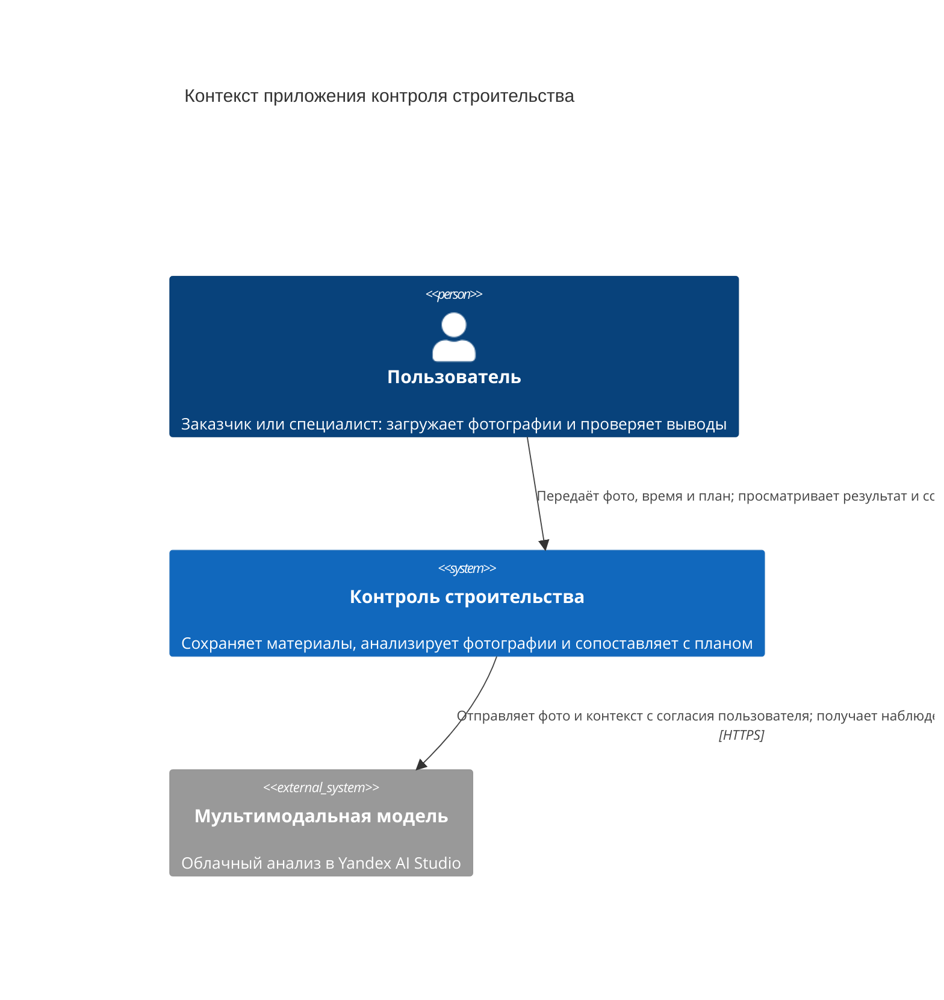
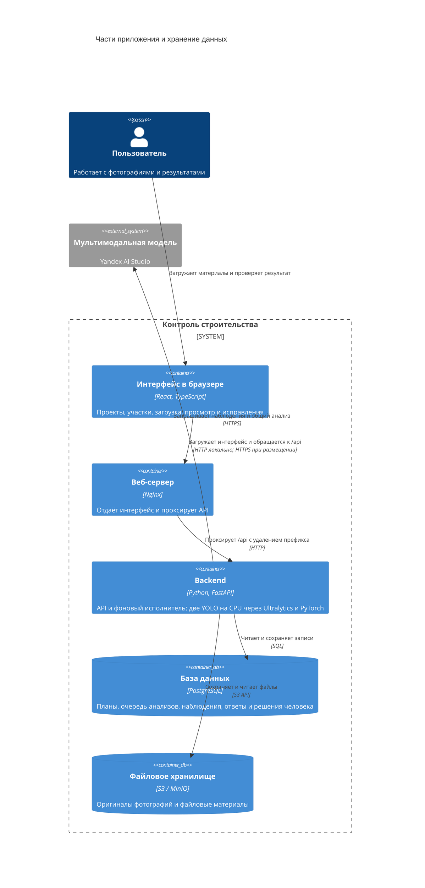

# Подход и технологии

[Оглавление](README.md) · [Обнаружение техники](EQUIPMENT_DETECTION.md) · [Этапы строительства](CONSTRUCTION_STAGES.md)

## Задача и выбранный подход

Фотография показывает ограниченную часть площадки в конкретный момент. Приложение помогает разобрать такие наблюдения: найти технику, описать сцену и подготовить вопросы для проверки на месте. Пользователь задаёт участок и время съёмки, при необходимости выбирает сохранённый план и проверяет результат.

В гибридном режиме две YOLO предлагают объекты на каждом кадре. Мультимодальная модель получает снимок и предложения обоих детекторов, сверяет их и объясняет расхождения. Затем она выполняет один общий разбор серии с зафиксированным контекстом. Правила приложения ограничивают сопоставление с планом сроками работ, пригодностью кадров и доступными наблюдениями.

Такое разделение сохраняет исходные находки детекторов и объяснение последующего вывода. Само наличие двух YOLO и облачной модели не подтверждает преимущество в точности или скорости. Для этого нужны отдельные измерения на проверенных данных.

Поддерживается и профиль только с Мультимодальной моделью: она разбирает фотографии без предложений YOLO, затем анализирует сохранённые наблюдения и контекст. У него нет гибридных сведений о сверке детекторов; профиль задаётся при настройке сервера, а не переключается автоматически при отсутствии весов.

## C4: контекст системы

В границу приложения входят интерфейс, обработка и собственное хранение данных. Облачный анализ выполняется внешним сервисом. Передача фотографий и контекста требует согласия пользователя для каждого запуска.

## C4: контейнеры

Здесь контейнер означает запускаемую часть системы. Схема отражает локальную конфигурацию Compose из репозитория; состояние удалённого размещения она не описывает.

Фоновый исполнитель работает внутри процесса backend. Он забирает задания из PostgreSQL, получает временное право на обработку и продлевает его. Перед публикацией результата сервер снова проверяет это право. Отдельного контейнера исполнителя или внешней очереди в этой конфигурации нет.

## Назначение технологий

| Технология | Что делает в приложении |
| --- | --- |
| React и TypeScript | Интерфейс загрузки, планы участков, фотографии с разметкой и проверка результатов |
| Python и FastAPI | Приём запросов, проверка данных, API и координация фонового анализа |
| Ultralytics и PyTorch | Загрузка двух YOLO и поиск техники на CPU сервера |
| Мультимодальная модель | Сверка объектов с изображением, описание сцены и общий разбор серии |
| PostgreSQL | Проекты, версии планов, задания, исходные ответы, наблюдения, сигналы и исправления |
| S3 / MinIO | Приватное хранение оригиналов; в локальной сборке S3 API предоставляет MinIO |
| Nginx | Выдача собранного интерфейса и передача API-запросов backend |
| Compose | Сборка и запуск сервисов; одноразовый init применяет миграции и импортирует XLSX-каталог |

Обучение YOLO выполняется отдельно, по [инструкции для Windows](../training/windows/README.md). При пользовательском анализе приложение использует готовые веса. Исправление разметки не запускает переобучение.

## Хранение и доступ

Оригинальные фотографии сохраняются без изменения. Исходные ответы, обработанные наблюдения и контекст общего анализа остаются доступны для проверки. План фиксируется выбранной версией; последующая правка расписания не меняет старый результат. Исправления человека создают отдельные версии разметки, подтверждение этапа сохраняется отдельной записью.

Приватное файловое хранилище закрыто от анонимного чтения, но пользовательские функции API доступны без входа в аккаунт. Поэтому публичное размещение требует внешнего контроля доступа. Для удалённого входа владельца требуется HTTPS. [Инструкция запуска](../infra/deploy/README.md) описывает профиль, доступ и восстановление после ошибок.

## Связь с кодом

Точки входа: [backend](../backend/app/main.py), [фоновый исполнитель](../backend/app/application/executor.py), [обработка анализа](../backend/app/application/deepseek_runtime.py), [Compose](../infra/deploy/compose.yaml). Состав библиотек зафиксирован в [backend/pyproject.toml](../backend/pyproject.toml) и [web/package.json](../web/package.json).
