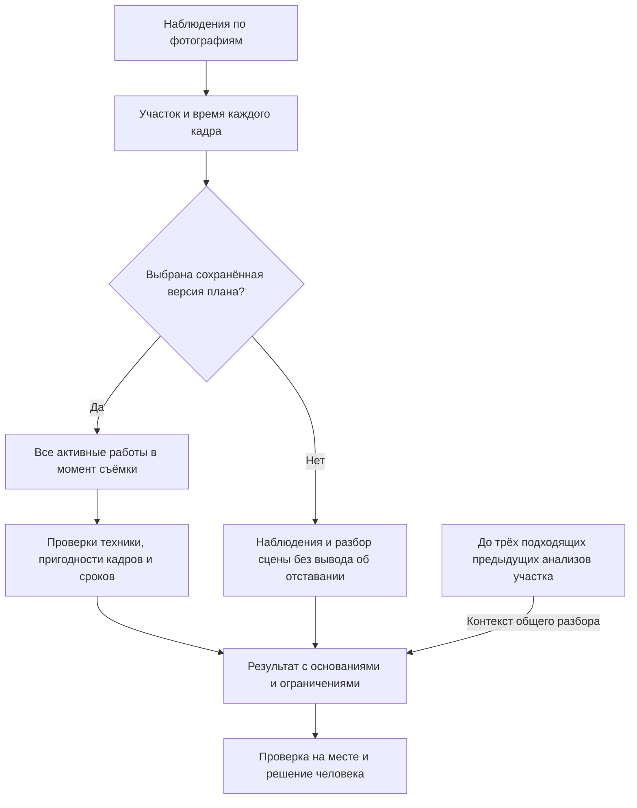

# Сопоставление с этапами строительства

[Оглавление](README.md) · [Подход](APPROACH.md) · [Обнаружение техники](EQUIPMENT_DETECTION.md)

## Три разных основания

| Что показано | Откуда берётся | Как читать |
| --- | --- | --- |
| Предположение об этапе | Мультимодальная модель рассматривает видимую технику, сцену и действия | Гипотеза по фотографиям, которая может быть неопределённой |
| Этап в плане | Пользователь сохраняет работы участка, сроки и технику | Запланированная работа; её наличие в плане не доказывает выполнение |
| Подтверждённый этап | Человек проверяет результат и сохраняет решение с комментарием | Отдельная запись, которая не переписывает ответ модели или план |

Структурированный план поддерживает три этапа: земляные, бетонные и дорожные работы. Этап записи можно оставить неуказанным. Перечень гипотез Мультимодальной модели шире: подготовка, демонтаж, земляные и бетонные работы, монтаж, дорожные работы, инженерные сети и благоустройство. Также предусмотрены неопределённый и неоднозначный этапы. Эти дополнительные гипотезы не создают новые этапы структурированного плана.

Каталог работ из XLSX помогает выбрать название работы и её применимость. Сроки и состав техники пользователь задаёт в плане участка; импорт каталога сам по себе не создаёт расписание.

## Примеры чтения фотографий

Примеры показывают возможные сочетания признаков. Одна машина не задаёт этап автоматически; объяснение должно учитывать весь кадр и его ограничения.

| Возможный этап | Техника и признаки сцены | Что ещё нужно проверить |
| --- | --- | --- |
| Земляные работы | Экскаватор или самосвал рядом с котлованом, траншеей, зоной выемки; видимое копание или погрузка | Машина может стоять или обслуживать другую работу. Видимый котлован сам по себе не подтверждает текущую выемку грунта |
| Бетонные работы | Автобетоносмеситель, опалубка, арматура или бетонная поверхность; видимая подача смеси | Барабан на машине не доказывает заливку. По готовой поверхности нельзя установить момент бетонирования |
| Дорожные работы | Каток, дорожное основание или покрытие; признаки уплотнения | Каток может уплотнять площадку вне дороги. По неподвижному снимку нельзя утверждать движение машины |

В одном анализе возможны несколько гипотез, привязанных к разным кадрам и работам. План служит контекстом сравнения; видимые основания этапа должны находиться на фотографиях.

## Как выбираются работы для сравнения

Анализ связан с выбранной версией плана. Редактирование плана после запуска не меняет эту связь. Для каждого кадра используются его время с часовым поясом и все работы в состоянии «активна», в сроки которых он попадает. Начало и конец интервала включены: кадр ровно в момент начала или окончания относится к этой работе.

Если интервалы соседних работ соприкасаются, на общей границе обе работы считаются активными. Система не выбирает одну из них по порядку в таблице. Если серия пересекает несколько интервалов, пригодность наблюдений оценивается для каждой работы отдельно.

## Ожидаемая и исключённая техника

Перед проверками техники для конкретной работы нужны минимум три независимых пригодных кадра в её интервале. Повтор одного файла не добавляет наблюдений: в коде независимость проверяется по контрольной сумме исходных байтов. Изменённые копии одного снимка могут иметь разные суммы, поэтому пользователь должен выбирать действительно разные кадры.

Сигнал об ожидаемой, но не найденной технике требует, чтобы минимум три независимых кадра были пригодны для оценки именно этого класса и имели статус «не обнаружен на кадре». Неопределённые объекты, перекрытая область и неразрешённые находки детектора не подтверждают отсутствие. Если на любом относящемся к работе кадре этот класс обнаружен, сигнал об отсутствии не создаётся. Дополнительный непригодный ракурс не отменяет три уже пригодных наблюдения.

Проверка ожидаемого автобетоносмесителя применяется к бетонным работам, ожидаемого катка к дорожным. Классы, которые анализ не поддерживает, не используются для вывода об отсутствии. Сигнал означает, что ожидаемая техника не найдена в пригодной серии; отсутствие техники на всей площадке он не доказывает.

Для сигнала об исключённой технике недостаточно того, что её нет в списке ожидаемой. В момент кадра её должны явно исключать **все одновременно активные работы**, и ни одна из них не должна её разрешать или ожидать. После выполнения общего условия о трёх пригодных кадрах обнаружение исключённого класса на подходящем кадре может стать основанием сигнала. Три отдельных обнаружения этой машины не требуются.

Например, если земляная работа исключает каток, а одновременно активная дорожная работа его разрешает, сигнала об исключённой технике не будет. Если другая активная работа вообще не указывает этот класс среди исключённых, общего явного исключения также нет.

## Недостаток данных и анализ без плана

При недостатке независимых пригодных кадров результат сообщает о недостаточных наблюдениях для конкретной работы или класса. Фотографии и доступные наблюдения сохраняются. Для гипотезы по сцене или видимого действия само по себе правило трёх кадров не требуется.

Возможный простой проверяется отдельно: нужны минимум два независимых пригодных кадра с различающимся надёжным временем, тот же участок и сопоставимый ракурс. Требуется обосновать, что это одна машина, и указать видимые признаки неработающего состояния, например сложенное рабочее оборудование или стоянку вне рабочей зоны. Статичная поза без этих оснований недостаточна. Результат остаётся предположением для проверки, без измеренной длительности простоя.

Без выбранного плана приложение сохраняет наблюдения и гипотезы сцены, но не формирует плановые риски или вывод об отставании. При наличии участка и видимых оснований возможны сигналы о процессе или безопасности. Они требуют осмотра: фотография не подтверждает расстояния или нарушение норм. Если план есть, но в момент съёмки нет активных работ, проверки ожидаемой и исключённой техники не дают основания для планового сигнала.

## Предыдущие анализы и решения человека

В общий разбор могут войти до трёх предыдущих успешных обычных анализов того же участка. Все кадры предыдущего анализа должны иметь время, а последний из них должен быть строго раньше первого кадра текущей серии. Выбираются ближайшие по времени подходящие анализы. В контекст передаётся их сохранённая аналитика.

История не используется без участка, полного набора времён с часовым поясом или хронологического порядка текущих кадров. Анализы другого участка и более поздние наблюдения исключаются. История дополняет контекст; она не заменяет три пригодных кадра текущей серии для проверки техники по плану.

Пользователь проверяет основание сигнала и сохраняет решение. Повтор тех же оснований не открывает заново закрытый человеком сигнал, а отсутствие риска в следующем анализе не закрывает прежние сигналы автоматически. Подтверждение этапа остаётся отдельным от гипотезы модели и может дать своё основание для сравнения с планом.

## Связь с кодом и тестами

Правила интервалов и одновременных работ находятся в [сопоставлении техники](../backend/app/domain/site_analysis.py), выбор истории в [обработке анализа](../backend/app/application/deepseek_runtime.py), допустимые этапы плана в [управлении участками](../backend/app/application/site.py).

В [тестах плана](../backend/tests/test_site_analysis.py) есть сценарии одновременных работ и недостаточных наблюдений. [Тесты гибридного анализа](../backend/tests/test_hybrid.py) проверяют повторные изображения, работу на границах интервалов и основания простоя. [Тесты облачного анализа](../backend/tests/test_deepseek.py) содержат сценарии без плана и выбора истории. Эти ссылки описывают существующие проверки, а не отчёт об их выполнении.
