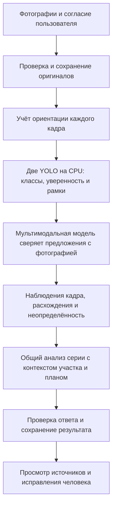
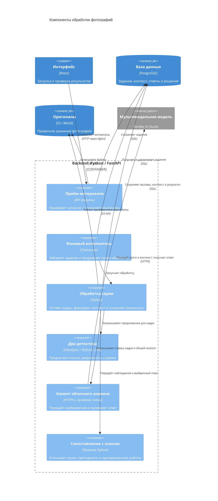

# Обнаружение техники

[Оглавление](README.md) · [Подход](APPROACH.md) · [Этапы строительства](CONSTRUCTION_STAGES.md)

## От оригинала к наблюдениям

Пользователь загружает один JPEG/PNG или серию из 2–8 кадров. Сервер проверяет формат и размер, сохраняет оригинальные байты в приватном файловом хранилище и связывает каждый файл с анализом. Для обработки учитывается EXIF-ориентация. Обе YOLO и Мультимодальная модель видят ориентированное изображение; координаты рамок относятся к нему. Исходный файл при этом не переписывается.

В гибридном режиме каждый кадр последовательно проходит через две YOLO на CPU сервера. Детекторы возвращают исходный класс, числовую уверенность и рамку. Их находки сохраняются раздельно. Файлы весов, список классов и правила сопоставления с каталогом проверяются перед исполнением.

Мультимодальная модель получает сам снимок и предложения обеих YOLO. Она должна описать каждую видимую машину один раз, связать с ней подходящие находки и объяснить расхождения. После разбора всех кадров один общий запрос получает фотографии серии, наблюдения, участок, время, выбранный план и подходящую историю. Подробнее о контексте: [сопоставление с этапами](CONSTRUCTION_STAGES.md).

## Объединение и расхождения

Если две YOLO нашли одну машину на одном кадре, итоговый объект может ссылаться на обе находки. Одна находка детектора не может принадлежать двум итоговым объектам. Для каждой находки требуется решение: связана с объектом, отклонена с объяснением или осталась неразрешённой. Приложение проверяет полноту этих решений и ссылки, но это не гарантирует правильность распознавания.

Принятие находки означает связь с физическим объектом. Его класс после сверки может отличаться от класса YOLO; расхождение сохраняется. Например, широкое название «подъёмная техника» само по себе не определяет тип крана. Мультимодальная модель также может описать видимую машину, которую не предложил ни один детектор.

Связь одной машины между разными снимками требует отдельного обоснования по виду и признакам объекта. Совпадение класса или рамки не служит автоматическим отслеживанием машины во времени.

## Каталог и объекты вне него

Каталог содержит восемь классов:

| Класс | Отличительный видимый признак для проверки |
| --- | --- |
| Экскаватор | Копающая стрела с ковшом |
| Самосвал | Опрокидывающийся кузов |
| Дорожный каток | Валец для уплотнения |
| Кран-манипулятор на грузовом шасси | Грузовая платформа и крановая установка |
| Автобетоносмеситель | Смесительный барабан |
| Бульдозер | Отвал для перемещения грунта |
| Грузовик | Грузовой автомобиль без подтверждённого более узкого класса |
| Мобильный кран | Крановое шасси, подъёмная стрела и крюк; без полезной грузовой платформы |

Эти признаки помогают проверять находку и не заменяют рассмотрение изображения. Объекты вне каталога, например башенный кран или буровая установка, сохраняются со свободным названием без присвоения класса каталога. Каталог автоматически не расширяется.

Если тип различить нельзя, сохраняется неопределённая строительная техника. Если объект виден, но его нельзя надёжно обвести, результат содержит объект без рамки и причину отсутствия локализации. Отсутствие рамки не превращает находку в отсутствие техники.

## Уверенность и пределы вывода

Числовая уверенность YOLO относится к конкретной находке конкретного детектора. Она не является вероятностью правильности всего анализа. После сверки Мультимодальная модель сохраняет название, статус идентификации и видимые основания; числовую уверенность для этого вывода приложение не придумывает.

Оценка класса на кадре имеет четыре состояния: обнаружен, не обнаружен на кадре, данных недостаточно, класс не анализировался. Непригодный кадр, неразрешённое предложение YOLO, неопределённый объект или невозможность оценить класс могут приводить к недостатку данных. «Не обнаружен» описывает только видимую область снимка.

Присутствие машины не доказывает выполнение работы. Для признаков работы нужно видимое действие, например копание или погрузка. Для возможного простоя нужны разные сопоставимые кадры с надёжным временем, признаки одной машины и видимые основания неработающего состояния. Один снимок не подтверждает движение, вращение барабана или длительность простоя.

## C4: компоненты обработки внутри backend

Компоненты на схеме исполняются в одном backend. YOLO вызываются локально, запросы Мультимодальной модели уходят во внешний сервис. API возвращает сохранённый результат интерфейсу независимо от времени выполнения фонового анализа.

## Проверка человеком

Результат связан с исходными фотографиями и наблюдениями. Можно посмотреть, какой кадр и какой объект послужили основанием сигнала. Ответы моделей сохраняются, а исправления рамки или класса создают отдельную версию разметки. Подтверждение этапа также не переписывает машинный вывод.

Для экспорта исправлений в обучающий набор требуются явное сопоставление с классами каталога, проверка всего кадра и одобрение владельцем. Зарезервированные контрольные изображения исключаются из экспорта. Само исправление не переобучает модель.

## Связь с кодом и тестами

Процесс описан в [обработке серии](../backend/app/application/deepseek_runtime.py), [детекторах](../backend/app/profiles/yolo.py) и [гибридном контракте](../backend/app/profiles/hybrid.py). Состав и сопоставление классов хранятся в [манифесте YOLO](../backend/app/data/yolo-manifest.json). [Тесты гибридного анализа](../backend/tests/test_hybrid.py) содержат сценарии повторного использования находки, неопределённости и непригодных кадров; наличие теста само по себе не означает, что он был выполнен.
